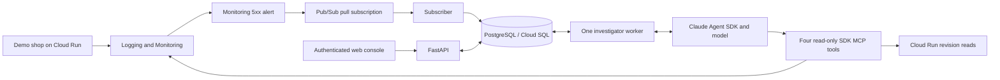

# On-call desk v1

This document describes the local and hosted implementations. Cloud Run can host the console and investigator with Cloud SQL Postgres; the local proxy only authenticates browser access. [The earlier hosted design](docs/design-history.md) is historical. V1 prioritizes investigation: rollback is proposed as a human-run command, not executed by the agent.

## Flow

## Components

- `shop/app.py`: Flask products, checkout and liveness endpoints. Failure switches create real structured error logs. No real payments.
- `sre_agent/main.py`: API and built React UI. Mutation routes require a per-process CSRF token and enforce configured host and exact origin allowlists. Google credentials never reach the browser.
- `sre_agent/store.py`: SQLAlchemy tables for incidents, messages, runs, evidence, events and human-recorded lessons. Short PostgreSQL transactions persist requests before acknowledgement. Schema creation is automatic. The hosted script provisions a dedicated Cloud SQL instance and database.
- `sre_agent/subscriber.py`: Google Pub/Sub pull client. Validates the configured project/service/region, persists a run, then acknowledges. Invalid messages are rejected. Persistence failures request redelivery.
- `sre_agent/worker.py`: one worker selected with a PostgreSQL session advisory lock. Claims queued runs serially. Caught failures become visible failed runs. Standby revisions retry leadership during rollouts, and database connection failures retry. On leader restart, interrupted runs are marked failed for human retry. An unset model leaves the worker paused while the subscriber can retain queued alerts.
- `sre_agent/runner.py`: fresh Claude SDK client per run, explicit stored context, isolated temporary working/config directory, no built-in tools, exact approved MCP tool names and a denying hook for other tools. Model calls are bounded by a turn, cost and time limit.
- `sre_agent/telemetry.py`: fixed read-only Google API calls for shop logs, request metrics, serving revisions and deployment audit events. Evidence includes query/window, timestamps, limits and Console links.
- `frontend/src/main.jsx`: incident list, retained chat, evidence/activity panes and human closure notes. Plain-text model output prevents HTML injection. No fabricated charts or automatic green status.

## State and behavior

Pub/Sub delivery IDs and client request IDs deduplicate intake; Monitoring incident IDs link notifications from the same incident. Unrelated alerts are not correlated. The worker can be offline while runs remain queued in Postgres. Pub/Sub holds alerts while the whole app is offline, within its configured retention window.

Each chat turn reloads recent messages, evidence and up to ten human-recorded lessons. It does not depend on SDK session files. Closing is a human API action, refused while work is queued or running. It saves the human's notes with incident provenance. Late alerts cannot reopen a human-closed record.

An SDK failure creates an explicit error response, not an invented diagnosis. Read-tool failures become missing evidence. Missing telemetry must not be described as health. The application does not mechanically verify the truth of the model's narrative: users must inspect evidence. Human closure is not proof of recovery.

## Hosted and local boundaries

The hosted script deploys one non-root Cloud Run process with instance-based CPU allocation and minimum/maximum service instances of one. Both console and shop require IAM authentication. A local gcloud proxy authenticates browser access; closing it does not stop the agent. Exact host/origin allowlists include Cloud Run's returned hostname and the localhost proxy origin. Secrets and ignored local state are excluded from build uploads.

Cloud SQL PostgreSQL 17 stores state through Cloud Run's mounted SQL socket. The generated database URL lives in Secret Manager. The attached investigator identity has telemetry reads, model prediction, the demo subscription, SQL connectivity and access to that one secret. Telemetry viewer roles cover the personal infrastructure project; fixed tool filters narrow investigations to the shop. No client-project roles or service-account keys are created. A separate builder reads the source bucket, writes images to the build repository and writes build logs. The shop receives no project roles.

Run one backend process locally, with Postgres in Docker, for development. Local ADC is separate from gcloud CLI login. Cloud Run uses attached-identity ADC; neither mode implies that the Claude model has been enabled. An Anthropic API key is an explicit local alternative.

Model runs are bounded by a default 240-second timeout, 15 turns and a two-dollar per-run SDK budget. These are not a project spending cap. The worker keeps one dedicated connection for its leader lock; normal queries use short transactions. Queued work survives restart, but interrupted runs require human retry. A database-session loss during an active model call can briefly overlap read-only investigations, so this is not exactly-once execution. Avoid console rollouts during recording.

No Slack, autonomous rollback, multi-client registry, alert correlation or parallel investigators are included. Operator scripts deploy and manually roll back the demo shop using separate credentials. See [hosted deployment](docs/hosted-demo.md) for recording, ongoing costs and shutdown. The authoritative cloud configuration is in [hosted.py](scripts/cloud/hosted.py), [demo.py](scripts/cloud/demo.py) and [Dockerfile](Dockerfile).

## Proof and limitations

See [verification](docs/verification.md) for checks actually run. Tests cover persistence, duplicate intake, human-only closure, SDK tool guards, missing-data behavior, hosted origin boundaries, alert region scope and worker handover. Browser checks cover the local app. Live model/GCP proof must be recorded separately; mock tests are not a claim of model accuracy.
