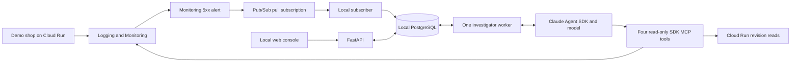

# On-call desk v1

This document describes the local implementation. [The earlier hosted design](docs/design-history.md) is historical. V1 prioritizes investigation: rollback is proposed as a human-run command, not executed by the agent.

## Flow

## Components

- `shop/app.py`: Flask products, checkout and liveness endpoints. Failure switches create real structured error logs. No real payments.
- `sre_agent/main.py`: localhost API and built React UI. Mutation routes require a per-process CSRF token and reject cross-origin requests. Google credentials never reach the browser.
- `sre_agent/store.py`: SQLAlchemy tables for incidents, messages, runs, evidence, events and human-recorded lessons. Short PostgreSQL transactions persist requests before acknowledgement. Local schema creation is automatic; no hosted database is provisioned.
- `sre_agent/subscriber.py`: Google Pub/Sub pull client. Validates the configured project/service, persists a run, then acknowledges. Invalid messages are rejected. Persistence failures request redelivery.
- `sre_agent/worker.py`: one local worker selected with a PostgreSQL session advisory lock. Claims queued runs serially. Caught failures become visible failed runs. On leader restart, interrupted runs are marked failed for human retry.
- `sre_agent/runner.py`: fresh Claude SDK client per run, explicit stored context, isolated temporary working/config directory, no built-in tools, exact approved MCP tool names and a denying hook for other tools. Model calls are bounded by a turn, cost and time limit.
- `sre_agent/telemetry.py`: fixed read-only Google API calls for shop logs, request metrics, serving revisions and deployment audit events. Evidence includes query/window, timestamps, limits and Console links.
- `frontend/src/main.jsx`: incident list, retained chat, evidence/activity panes and human closure notes. Plain-text model output prevents HTML injection. No fabricated charts or automatic green status.

## State and behavior

Pub/Sub delivery IDs and client request IDs deduplicate intake; Monitoring incident IDs link notifications from the same incident. Unrelated alerts are not correlated. The worker can be offline while runs remain queued in Postgres. Pub/Sub holds alerts while the whole app is offline, within its configured retention window.

Each chat turn reloads recent messages, evidence and up to ten human-recorded lessons. It does not depend on SDK session files. Closing is a human API action, refused while work is queued or running. It saves the human's notes with incident provenance. Late alerts cannot reopen a human-closed record.

An SDK failure creates an explicit error response, not an invented diagnosis. Read-tool failures become missing evidence. Missing telemetry must not be described as health. The application does not mechanically verify the truth of the model's narrative: users must inspect evidence. Human closure is not proof of recovery.

## Minimal operational boundary

Run one backend process bound to localhost, with Postgres in Docker. No cloud console hosting, Cloud SQL, Slack, autonomous rollback, multi-agent investigation or alert storm grouping is included. Tool execution is read-only even when a chat message requests a deployment. Operator deployment and manual rollback scripts use separate gcloud credentials.

Use impersonated ADC for the read-only investigator service account. Model invocation through Vertex requires a separately enabled model; an Anthropic API key is an explicit alternative. Personal gcloud login alone is insufficient for Python libraries.

The local worker owns one dedicated database connection for its leader lock; normal queries use short-lived pooled connections. This single-operator demo is not designed as a distributed incident processor. A process restart interrupts a model run. Log reads and diagnosis quality still depend on cloud access and API availability.

## Proof and limitations

See [verification](docs/verification.md) for checks actually run. Tests cover persistence, duplicate intake, human-only closure, SDK tool guards and missing-data behavior. Browser checks cover the local app. Live model/GCP proof must be recorded separately; mock tests are not a claim of model accuracy.
