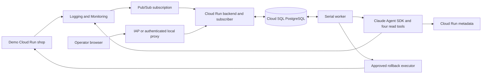

# On-call desk architecture

## Executive summary

The on-call desk investigates one demo Cloud Run shop and supports operator-approved recovery. PostgreSQL is the source of truth for incidents, investigation runs, messages, evidence, events, lessons and rollback proposals. The Python backend serves the React console and runs a serial background worker.

The key boundary is that the model has only four read tools. A production change must originate from an explicit operator request and approval, pass the deterministic executor's checks, and produce fresh checkout evidence before the incident becomes resolved. Model output and log text cannot approve a mutation.

### System architecture

### Dependency hierarchy

`main.py` composes settings, store, subscriber, investigator and rollback executor. The subscriber only persists validated notifications. The worker claims persisted work and calls either the investigator or executor. Both write observations through the store. Google clients live in `telemetry.py` and `rollback.py`.

The SDK cannot call the executor. Only the API approval route advances a saved proposal into executable work. The service identity is shared by these components; the tool boundary is enforced in application code, not separate process credentials.

## Incident investigation

Monitoring notifications must match the configured project, shop service and region. The subscriber persists a notification and queued run before acknowledging Pub/Sub. Invalid inputs are discarded; persistence failures request redelivery. Delivery IDs deduplicate intake and Monitoring incident IDs group notifications for the same incident. Different incidents are not correlated.

A PostgreSQL session advisory lock selects one worker. Standby revisions retry leadership during rollout. Each investigation gets a fresh SDK client, isolated temporary settings directory, stored conversation context and up to ten human-recorded lessons. Four in-process MCP tools read bounded logs, metrics, revisions and deployment events. All other tools, including shell access, are denied. Telemetry query windows support up to 24 hours; request totals cover the fetched delta buckets separately from the bounded point sample, and model runs to 240 seconds, 15 turns and a two-dollar SDK budget by default.

An unset model leaves investigations queued. Model and tool failures stay visible and cannot establish health. Queued work survives restart; interrupted investigations require a human retry. Database-session loss can briefly overlap read-only work, so investigation execution is not exactly once.

## Approved rollback

An explicit operator chat command such as `rollback the change` selects a deterministic API path. It reads the configured healthy revision and current Cloud Run state, rejects split traffic or a reconciling deployment, and stores a five-minute proposal. The UI displays the exact current and target revisions. Model-generated text cannot enter this approval route.

The approval endpoint checks the incident, proposal expiry, active work and globally active mutations, then persists approval and actor provenance. The worker claims the action once. Immediately before the change, the executor rechecks the configured service/target, URL, revision and etag. It sends a Cloud Run update with only the `traffic` field and the saved etag. A changed service rejects the stale proposal.

After the operation completes, five authenticated fake checkout requests must return HTTP 200, `paid`, and `v1-healthy`. The serving revision is checked throughout and again at the end. Results include observation times. Only then does a transaction lock the incident, cancel queued notification follow-ups and resolve it. Late notifications cannot reopen resolved records. Failed checks keep the incident active.

Interrupted mutations become failed and are not replayed. A previous executor cannot overwrite the replacement worker's uncertain verdict. An operation timeout may mean traffic changed without confirmed recovery, so the operator must inspect fresh evidence before retrying. The known healthy target is configured from the operator's verified deployment, not inferred from revision age.

## UI and trust boundaries

The light console separates investigating, needs attention, rolling back, verifying recovery and recovery verified. Counts cover all active records, while the sidebar lists the latest 100. Completing a model run never makes an incident green. A recovery result is a dated observation, not a permanent assertion of service health. Manual closure requires notes and does not prove recovery.

Mutation routes require a per-process CSRF token and exact host/origin checks. Responses are not cached. Model Markdown is rendered without raw HTML or remote images; evidence links are restricted to Google Cloud HTTPS destinations. Alert payloads remain untrusted data behind a disclosure.

The console requires Cloud Run IAM access. `access.py browser` can enable Google IAP for the named operator and grant Google's proxy identity console invocation. Before IAP, a local gcloud proxy supplies browser authentication. Neither the browser nor the model receives cloud keys.

The investigator identity has telemetry viewer access in the demo project, model invocation, the demo subscription, SQL connectivity and access to its database secret. Fixed tool filters constrain the application scope; viewer IAM is not per-client isolation. `access.py rollback` adds service-update and invocation rights on the demo shop only. IAM service-update permission is broader than traffic updates; the executor's request mask supplies that narrower restriction. No client project is connected.

## Runtime and storage

Cloud Run hosts one non-root backend process with CPU allocated outside requests and a minimum/maximum instance setting of one. Rollouts can briefly overlap revisions. Cloud SQL PostgreSQL 17 stores durable state through a mounted SQL socket; its URL comes from Secret Manager. A separate builder identity owns source/image build access. The fake shop performs no real payments.

Schema initialization creates missing tables, including additive `rollback_actions`; it does not migrate existing columns. Short transactions never span model or Cloud Run calls. One dedicated connection holds worker leadership. Cloud SQL and the minimum Cloud Run instance incur ongoing charges even with the browser closed.

## Source map and verification

- [API](sre_agent/main.py), [store](sre_agent/store.py), [worker](sre_agent/worker.py): intake, state, counts, approval and lifecycle.
- [Investigator](sre_agent/runner.py), [telemetry](sre_agent/telemetry.py): model boundaries and evidence.
- [Rollback executor](sre_agent/rollback.py): proposal, expiry, traffic update and checkout verification.
- [Hosted deployment](scripts/cloud/hosted.py), [access setup](scripts/cloud/access.py), [demo scripts](scripts/cloud/demo.py): cloud configuration and operator setup.
- [Recovery runbook](docs/approved-recovery.md): recording sequence, IAM limitations and failure handling.

Tests cover real PostgreSQL persistence, deduplication, CSRF, expiry, stale plans, concurrent mutations, notification/closure races, restart uncertainty, request masks and failed recovery. Frontend tests distinguish triage completion from verified recovery. Mock cloud tests establish code behavior, not live model accuracy. Live cloud rollout, IAP and end-to-end rehearsal evidence must be recorded separately when performed.
