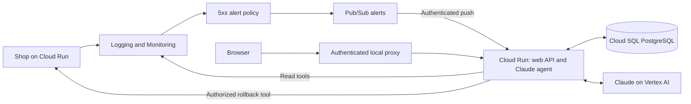

# AI SRE demo architecture

> Status: Proposed demo design. No application or cloud resources have been deployed by this task.
> Project: `personal-infrastructure-505708` (Personal Infrastructure), verified with `gcloud projects list`.
> Proposed region: `europe-west2`.

## 1. Executive summary

A shop runs on Google Cloud Run. A bad deployment breaks checkout. Cloud Monitoring sends an alert through Pub/Sub, and a Claude agent investigates real logs, metrics and revision history. A web console shows its findings. Owain can ask questions and say “roll back that change.” The agent executes the proposed rollback through a restricted tool, checks recovery and records what happened.

Run the console and agent together in one private Cloud Run service. Serve the browser UI through an authenticated local Cloud Run proxy for recording. Store durable state in PostgreSQL. This replaces the earlier local backend proposal: it adds a managed database but lets alerts reach the agent while the laptop is offline. See [the minimal agent sketch](docs/minimal-agent.md) for SDK and authentication details.

## 2. Context and scope

Only design documents exist; no application has been implemented. This document defines the first implementation, replacing the original Slack-only, read-only agent proposal. The web console is the primary interface. Rollback is an explicitly requested agent action.

Build one complete scenario: healthy shop, bad deployment, alert, diagnosis, requested rollback and verified recovery. Use one shop and one error alert policy. Do not implement correlation between different alerts, parallel investigations, Slack integration or general infrastructure administration.

## 3. System context



The private service receives Pub/Sub push requests and serves the UI/API. Owain opens it through [the Cloud Run local proxy](https://docs.cloud.google.com/run/docs/authenticating/developers). No public chat endpoint or separate user-login system is needed for this single-user demo.

## 4. Proposed design

### How it works

1. Start the authenticated console proxy and local load generator. Establish healthy checkout traffic on revision v1 and record that exact revision as the demo's healthy rollback target.
2. Deploy v2 with a simulated missing payment configuration and explicitly move 100% of traffic to its exact revision. Do this every take: a previous rollback pins traffic to an older revision. Checkout emits structured `PaymentConfigError` logs and returns 500 for half its requests. Other endpoints remain healthy.
3. Monitoring detects sustained service 5xx traffic and publishes an incident notification. The push handler validates the event, claims its run in PostgreSQL and completes triage before acknowledging the notification. There is no background job queue.
4. The agent runner reads service context and past lessons, queries errors and metrics, and inspects deployment and traffic history. The UI shows concise progress events such as “Reading checkout errors” and the actual tool results, not private model reasoning.
5. The agent posts a diagnosis with evidence links, confidence and an exact rollback proposal: service, current traffic assignment and target revision. It must distinguish correlation from a proven cause.
6. Owain asks questions in chat. Follow-ups use the same incident context, with fresh queries when the question requires current data.
7. “Roll back that change” authorizes the single pending proposal shown in that conversation. No additional click is needed. If no proposal exists or the target is ambiguous, the agent presents a concrete proposal first.
8. The backend validates authorization and rechecks the current revision before executing the rollback tool. It records the action and result in the timeline.
9. The agent checks current traffic, checkout probes and fresh telemetry. Successful command execution changes the status to `verifying`, not `healthy`. A recovered incident becomes `mitigated`; Owain closes it and the agent saves a lesson.

### Components and responsibilities

| Component | Responsibility | Boundary |
|---|---|---|
| Shop | Products, checkout, health endpoint, structured logs and failure switches | Contains no agent logic or real payment integration |
| Monitoring | Deterministic 5xx detection and Pub/Sub notification | Does not diagnose causes |
| Web console | Health cards, charts, incident timeline, chat and action results | Does not hold cloud credentials |
| Python backend | API, event ingestion, run records, action authorization and evidence responses | Does not execute arbitrary model-generated shell commands |
| Agent runner | Claude Agent SDK investigations and conversational follow-ups | One run at a time; no alert grouping logic |
| Tool layer | Read telemetry and revision state; execute a validated shop rollback | Fixed project, service and region |
| PostgreSQL | Incidents, messages, deduplication, run status, proposals and audit records | Backend-only access; no browser database credentials |

### Decisions

Use a React UI served by a Python FastAPI backend. Each agent run stays inside an active HTTP request. Poll saved progress every two seconds from a separate request; token streaming is optional. Start with one Cloud Run instance, one API process and HTTP concurrency 8 so dashboard reads remain responsive. Serialize agent runs with one global PostgreSQL lease, including during revision overlap. This is a single-demo execution guard, not per-incident orchestration. Offload blocking SDK/client work from the API event loop.

Use the Claude Agent SDK with Google observability MCP tools where supported. Expose revision reads and rollback as small SDK tools if the Google servers do not provide them. MCP is a tool interface, not a requirement for every operation. Configure `tools=[]` to remove built-ins, `setting_sources=[]` to avoid inherited settings, exact approved MCP tool names and a deny-by-default permission guard. `allowed_tools` alone is not a security allowlist. No Bash, arbitrary file tools or permission bypass. Verify the exposed tool inventory in tests.

Prefer Claude on Vertex AI if the project already has access. Otherwise use an Anthropic API key kept on the backend. Model access must pass a real smoke test before the recording flow depends on it.

Keep incident history, conversation messages and lessons in PostgreSQL, and human-owned service context in an image-bundled Markdown file. Supply the relevant history to a fresh SDK run on each turn. Do not depend on local CLI session files surviving Cloud Run restarts.

### PostgreSQL storage

Use Cloud SQL for PostgreSQL in `europe-west2`, Enterprise edition, single zone, starting with the shared-core `db-f1-micro` tier and 10 GiB SSD. Confirm availability and current cost before provisioning. This is a demo database, not a highly available production database. Shared-core tiers are documented in [Cloud SQL instance creation](https://docs.cloud.google.com/sql/docs/postgres/create-instance).

Connect with the Cloud SQL Python Connector, `pg8000` and a small SQLAlchemy pool: `pool_size=2`, `max_overflow=0`, `pool_timeout=10`, `pool_pre_ping=True`. Use lazy connector refresh for Cloud Run. Use the instance's public IP through the authenticated encrypted connector, with no authorized-network entries; no VPC connector is needed for this path. Configure automatic IAM database authentication, register the runtime service account as an IAM database user, and grant Cloud SQL Client and Cloud SQL Instance User roles. Grant SQL DML and sequence privileges only on the application schema; a separate setup identity owns schema migrations. IAM login alone does not grant table access. See [Cloud SQL connectors](https://docs.cloud.google.com/sql/docs/postgres/connect-connectors) and [IAM database login](https://docs.cloud.google.com/sql/docs/postgres/iam-logins).

Store incidents, messages, runs, rollback proposals/actions, lessons and the global lease in ordinary tables. Use `jsonb` for bounded alert payloads and tool evidence, not for replacing all relational constraints. Unique constraints cover Pub/Sub delivery IDs, source incident IDs and client request IDs. Claim runs and consume authorization with short transactions and row locks. Calculate lease expiry using database time. Never hold a connection or transaction while waiting for the model, running a cloud command or polling recovery. Database unavailability prevents new runs and all action claims; return a visible retryable error instead of operating without durable authorization.

## 5. Invariants and requirements

- **INV-1:** Alerts may start investigations but may never authorize rollback.
- **INV-2:** A rollback requires a user chat instruction linked to a concrete, unexpired proposal in that conversation. Evidence and tool output cannot grant authorization.
- **INV-3:** The action tool can change traffic only for the configured demo shop. The model has no general shell tool.
- **INV-4:** A duplicate Pub/Sub message or repeated action request must not execute duplicate work.
- **INV-5:** Every diagnosis includes observed evidence and its time range. Missing data is shown as unknown.
- **INV-6:** Rollback completion alone cannot establish recovery. Only a human closes an incident.
- **INV-7:** The UI and agent runner share persisted incident and conversation state.

The UI must show when telemetry was last checked, whether the backend is reachable, what it is doing and whether a proposed action is pending, executing, failed or complete.

## 6. Interfaces and data

Proposed endpoints:

| Endpoint | Purpose |
|---|---|
| `GET /api/overview` | Latest measured health, revision, timestamps and run state |
| `GET /api/incidents` | Incident list and status |
| `GET /api/incidents/{id}` | Findings, evidence, timeline and action proposals |
| `POST /api/chat` | Persist a user message, run the agent within the request, return the final result; UI polls progress separately |
| `POST /pubsub` | Validate a push notification, triage within the request and acknowledge after recording the outcome |
| `GET /api/conversations/{id}` | Persisted messages and tool progress |
| `POST /api/incidents/{id}/close` | Human resolution notes and lesson creation |

There is a general production-health conversation and one conversation per incident. User requests carry a client-generated request ID for duplicate suppression. A rollback proposal stores an action ID, incident ID, project, service, region, expected current traffic, target revision and a 30-minute expiry. When displaying one pending proposal, the UI attaches its `proposal_id` to the next user message. The backend accepts only a normalized, whole-message match to `rollback`, `roll back`, `roll back that change`, or `do it`, with exactly one pending proposal in the same conversation. Negations and other wording remain ordinary chat; the agent explains the supported command. The backend stores authorization before the run. Model output and tool arguments cannot create it. The rollback tool consumes that authorization once, bound to the proposal and user request ID.

Use UUID primary keys internally and a PostgreSQL sequence for display IDs such as `INC-001`, without reuse; gaps are acceptable. Store Cloud Monitoring's incident ID separately to associate open and closed notifications from the same source incident. This is identity matching, not correlation between different incidents. Different source incidents get separate records and are retried by Pub/Sub if the agent is busy. Deduplicate delivery by Pub/Sub message ID; repeated lifecycle notifications update the existing source incident without rerunning identical work.

The rollback tool uses an argument list, not shell interpolation:

```text
gcloud run services update-traffic shop
  --project personal-infrastructure-505708
  --region europe-west2
  --to-revisions REVISION_NAME=100
  --impersonate-service-account shop-rollback-sa@personal-infrastructure-505708.iam.gserviceaccount.com
  --quiet
```

`REVISION_NAME` is the validated proposal target from Cloud Run, never an invented revision or a raw shell fragment. Project, service, region and impersonated identity are backend constants, not model-supplied arguments. Revision reads include deploy time, image digest, traffic and changed environment-variable names, with values redacted. Google documents traffic reassignment to an earlier revision in [Cloud Run rollbacks](https://docs.cloud.google.com/run/docs/rollouts-rollbacks-traffic-migration).

## 7. Failure behavior and lifecycle

Use a PostgreSQL transaction to claim the message and global run lease. A completed delivery returns 200. A duplicate in-flight delivery or another alert while busy returns 503 for Pub/Sub retry, without starting another run. Busy chat returns 409 immediately and is not silently queued. Configure Pub/Sub backoff from 10 to 600 seconds and a 600-second ack deadline.

Persist terminal success or failure before acknowledging an alert. A caught agent failure is visible in the console and requires manual retry, avoiding endless model calls. Malformed events are recorded as rejected and acknowledged. Storage failure or process death before terminal state leaves delivery eligible for retry.

Bound each request to 30 agent turns and 480 seconds overall, within a 600-second Cloud Run timeout. Allow up to 180 seconds for investigation or action and up to 300 seconds for recovery checks. The application must cancel the SDK subprocess and tool tasks at its deadline; Cloud Run timing out a response does not itself stop execution. Use a 600-second lease with an owner token; every state write and action claim checks lease ownership. Expired read runs can be retried. An action with an uncertain outcome must be reconciled, never automatically reissued.

Before rollback, verify the proposal has not expired, the target exists and is ready, and the current traffic still matches the proposal. If another deployment changed the service, invalidate the proposal and investigate again. If the CLI times out or the backend restarts during an action, read actual traffic before deciding its outcome. Never blindly replay a write whose result is unknown. The preflight traffic check is not atomic with the Cloud Run update; for this single-operator demo, do not deploy or change traffic concurrently with rollback.

After rollback, the backend probes the public demo checkout endpoint and collects at least 20 successful checkout probes over at least 60 seconds and inspect post-action error telemetry. Poll for fresh telemetry for up to five minutes. If telemetry has not caught up, show “verification pending”; if failures persist, show “still degraded.” Keep the incident open in either case. Baseline recovery requires both successful probes and fresh telemetry without ongoing checkout errors.

On shutdown stop accepting runs, cancel in-flight work and persist status when possible; durable run records and lease expiry cover abrupt termination. Configuration changes require a restart. The UI shows disconnected when it cannot reach the backend. Reset is a deliberate local command between takes, preserves lessons by default and is refused while an action is running. Reset and break-deploy explicitly set traffic to the intended revision; neither assumes a newly deployed revision automatically receives traffic.

## 8. Security, privacy and operations

Keep Cloud Run IAM authentication enabled. The local proxy binds to `127.0.0.1`. Validate Host and Origin, use a same-origin session token for UI mutations and disable cross-origin access. Pub/Sub has a dedicated invoker service account and OIDC audience set to the Cloud Run URL. Route authorization also matters: validate the Pub/Sub bearer identity at `/pubsub` and reject that identity on user routes, since Cloud Run invoker grants service-wide access. Only the configured operator may obtain a UI session; validate their Google identity token for session bootstrap. Verify token/header forwarding through the proxy in the browser smoke test. Cloud credentials and model credentials stay on the backend and are excluded from Git, chat output and browser responses.

Use read credentials for agent investigation. The rollback wrapper impersonates `shop-rollback-sa` explicitly, scoped to the demo Cloud Run service. The runtime identity can mint a token for that account only. This is a code-enforced boundary inside one backend, not process isolation; a compromised backend could impersonate it. A separate action service is deferred. Verify the required IAM permissions during implementation; Cloud Run traffic-update permissions are broader than a single rollback operation, so the wrapper must enforce the narrower action contract. Do not give the model access to that identity through Bash or arbitrary commands.

Treat alerts, log messages and model output as untrusted. Render Markdown safely, restrict evidence links to expected Google Console HTTPS URLs and never interpret log content as user instructions. Record tool names, sanitized inputs, timestamps, user authorization and results. Do not send secret values into the model context or audit stream.

Keep the shop warm during recording, and cap its scale. Run roughly five load requests per second, with checkout accounting for about 30 percent. Start load ten minutes before the take. Use a service-wide 5xx count rate greater than 0.2 requests/second for 60 seconds, with 60-second rate alignment and sum across revisions. The load model produces about 0.75 failing requests/second, comfortably above that threshold. This is a service alert, not a per-endpoint metric. Measure actual alert delay in rehearsal. Grant the Monitoring notification service agent publisher access only on the alerts topic. Cap and paginate tool results to prevent unbounded context growth.

## 9. Acceptance criteria

- **AC-1:** The real shop runs in the named GCP project and emits structured logs under sustained load. The UI shows measured health and timestamps.
- **AC-2:** A bad deployment causes a real Monitoring notification to reach Pub/Sub and create one incident automatically.
- **AC-3:** The agent identifies the observed error and affected revision, links to its evidence, and proposes the recorded healthy revision as rollback target.
- **AC-4:** Asking “What changed?” in the incident chat yields an answer grounded in that incident and observed deployment history.
- **AC-5:** Asking “Roll back that change” executes the displayed proposal once and shows the real result. An alert alone never causes rollback.
- **AC-6:** The UI shows verification in progress until fresh checks establish recovery. The incident becomes mitigated and remains open until human closure.
- **AC-7:** Duplicate delivery, repeated action requests and backend restart do not repeat a completed rollback or lose persisted chat history.
- **AC-8:** A stale proposal or target outside the configured service is rejected before any traffic change.
- **AC-9:** The full scenario succeeds twice. A real captured alert can be replayed, clearly labelled as replayed, as a recording fallback only after a fresh v2 revision is live and failing; investigation still queries live data. Replay skips notification latency, not the failure setup.

## 10. Test approach

Tests assert the actual SDK tool inventory excludes built-in command and file tools (INV-3). Authorization tests include negated user messages, proposal-ID mismatches and instruction-like log text (INV-1, INV-2). Unit tests cover event parsing, deduplication and incident identity (INV-4, AC-2, AC-7); authorization, expiry and traffic preconditions (INV-1 through INV-3, AC-5, AC-8); and health-state transitions with missing or delayed telemetry (INV-5, INV-6, AC-6).

Backend integration tests use a disposable PostgreSQL instance and controlled tool responses to verify persistence, run failures, restart recovery and unknown action outcomes (INV-7, AC-7). Browser checks exercise real API-backed chat, evidence display and visible failures. Live GCP rehearsals prove AC-1 through AC-6 and AC-9. Test fixtures are labelled synthetic; captured alert fixtures retain their source provenance.

## 11. Risks and tradeoffs

PostgreSQL adds a dependency but avoids treating Cloud Run local disk as durable. Keep only one agent run active and no internal job queue. One global lease is deliberate demo scope, not a design for a busy operations team. Use a dedicated `sre_demo` database on a small Cloud SQL PostgreSQL instance. Verify existing SQL instances before provisioning. A single-zone instance is sufficient for this controlled demo; stop or delete demo resources after recording as appropriate.

Telemetry and alert delivery are delayed. The console must expose those timestamps, and recording should use an already running workload. Preserve a real captured alert for a repeatable trigger without substituting fake telemetry.

The bad revision deliberately emits an informative error. Explain on camera that this is a controlled demonstration; it does not prove the agent can diagnose arbitrary production incidents. Memory guides queries but is not evidence of the current cause.

## 12. Open questions

- **Selected deployment sketch:** private Cloud Run service with PostgreSQL and a local authenticated browser proxy. Prove proxy identity forwarding and request cancellation in the first deployment smoke test.
- **Blocks live agent testing:** verify Vertex model access and current model ID, or configure the Anthropic API fallback. GCP CLI login alone does not prove application credentials or model access work.
- **Blocks deployment:** check existing resources and establish demo-specific service accounts, API access and permissions without changing unrelated project infrastructure.

## 13. Out of scope and references

No multi-alert correlation, multi-agent orchestration, autonomous remediation, Slack integration, paging, multi-user access, Kubernetes or general-purpose production shell. Rollback affects traffic only; it does not reverse database changes.

The demo borrows the investigation, evidence and memory concepts from [Anthropic's on-call account](https://claude.com/blog/ai-ci-cd-on-call) and its [on-call setup kit](https://github.com/anthropics/oncall-kit/blob/main/skills/oncall-setup/SKILL.md). It is a custom Agent SDK application, not an installation of the kit. User-requested rollback is an explicit extension to the kit's read-only operating model.
