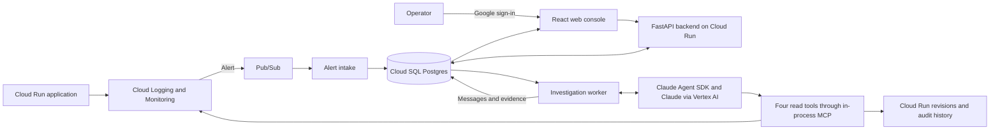
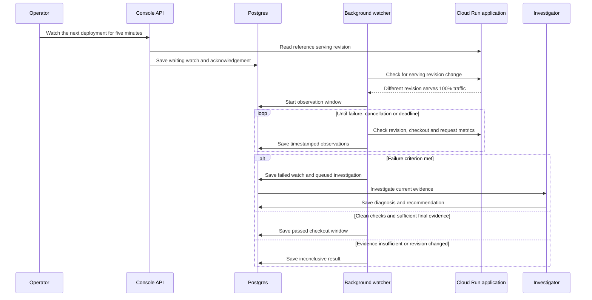
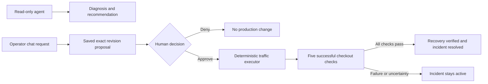

# I Built an AI SRE with Claude

An approximately 10–12 minute video for developers who already deploy applications
and want to understand how an agent can help operate them. The viewer should leave
able to explain the alert-to-investigation loop, the deployment-watch workflow,
and the boundary between diagnosis and authorized recovery.

## Story and positioning

The central question is: can an agent gather enough production evidence to help
an operator make a recovery decision, then verify the outcome?

Opinion [medium]: production operations is a strong agent use case because it
combines expensive human investigation, customer impact and evidence distributed
across tools. This changes if the agent lacks reliable telemetry or application
context. The demo establishes specific working paths, not general production
readiness or measured savings in engineer hours.

Existing products and reference implementations are part of the story. This is
an independent Claude Agent SDK implementation on Google Cloud, with application
specific checks and a web console. It is not Google's ADK implementation, a
Cloud Assist integration or an installation of Anthropic's Slack on-call kit.

Suggested title: **I Built an AI SRE with Claude**.
Thumbnail: **CLAUDE ON CALL**, showing the investigation and failed checkout.
Search volume for this title has not been measured.

## 0:00–0:45: intro

Visual: checkout returns 500 beside a green `/health` response. Cut briefly to
an investigation linking `PaymentConfigError` to a serving revision.

Spoken:

> I built an AI SRE with Claude to investigate a problem that can cost businesses
> hundreds of thousands of dollars.
>
> When an application fails, engineers spend time searching logs, comparing
> metrics and working out what changed, while customers are already affected.
> Uptime Institute's 2026 outage report found that 57% of respondents said their
> most recent major outage cost more than a hundred thousand dollars.
>
> I think production operations is one of the strongest uses for AI agents.
> They can gather evidence when an alert arrives and help us check a deployment
> before we leave it running.
>
> So I connected Claude to an application on Google Cloud, deliberately broke
> checkout, and tested its investigation and recovery checks. Let's look at how
> it works.

Source overlay: **Uptime Institute, Annual Outage Analysis 2026; 2025 survey**.
The statistic covers IT/data-center outages reported by survey respondents. It
is not an average outage cost, a per-minute figure or evidence that every SaaS
incident costs $100,000. It does not establish cost savings from this agent.

Reference: [Uptime's 2026 report announcement](https://uptimeinstitute.com/about-ui/press-releases/uptime-announces-annual-outage-analysis-report-2026).

## 0:45–1:45: the trend and the two use cases

Visual: briefly show Google's investigation documentation and Anthropic's article,
then display the two triggers feeding a shared investigator.

Spoken:

> This is already becoming a product category. Google has Cloud Assist
> investigations, AWS has a DevOps Agent, and PagerDuty has an SRE Agent. They
> have different integrations and different boundaries around what they can do.
>
> Anthropic also publishes an on-call kit that turns incident history into
> playbooks and starts with read-only investigation in Slack. Humans own the fixes.
>
> I built my own to understand the mechanics and control the workflow: which
> signals it checks, the application context it receives, the rules for approval
> and what evidence counts as recovery.
>
> There are two use cases here. An alert can start an incident investigation.
> Or I can ask the same system to watch a deployment and investigate if its
> checkout checks or metrics show a regression.

References:

- [Google Cloud Assist investigations](https://docs.cloud.google.com/cloud-assist/investigations).
- [Google's agentic SRE work](https://cloud.google.com/blog/products/devops-sre/how-google-sre-is-using-agentic-ai-to-improve-operations).
- [AWS DevOps Agent incident response](https://docs.aws.amazon.com/devopsagent/latest/userguide/production-operations-autonomous-incident-response.html).
- [PagerDuty SRE Agent engineering](https://www.pagerduty.com/eng/inside-pagerdutys-sre-agent-how-we-built-deep-incident-investigation/).
- [Anthropic's CI on-call example](https://claude.com/blog/ai-ci-cd-on-call) and [on-call kit](https://github.com/anthropics/oncall-kit).

Do not claim this category is new, Google lacks a solution, all products perform
automatic remediation, or this custom build is cheaper/better than those products.

## 1:45–3:00: architecture

Visual: reveal the trigger, persistence, model and evidence paths in order.



Spoken:

> Monitoring detects the failure and sends a notification through Pub/Sub.
> The backend stores the incident in Postgres before acknowledging the message.
> A worker starts the investigation and saves the evidence and conversation.
>
> This uses the Claude Agent SDK and accesses Claude through Vertex AI. The
> model has four tools: logs, request metrics, serving revisions and deployment
> audit events. It has no shell tool and cannot change production through those tools.
>
> The console and workers run on Cloud Run, with Postgres on Cloud SQL. Closing
> my browser doesn't stop the agent. The stored history lets me return to the
> same investigation and challenge its diagnosis.

Point out that the model receives observations from tools. Monitoring itself
still detects the alert. The model is not continuously reading every log line.
The deployment watcher, below, is an additional scheduled application workflow.

## 3:00–5:00: incident investigation

Precondition: updated healthy shop deployed, runtime access checked, synthetic
traffic running, and console signed in. Use [the recording runbook](demo-rehearsal.md)
for actual commands. Generate traffic for several minutes before the scene.

Shot sequence:

1. Show successful checkout traffic and ask `How is production doing?`.
2. Deploy the broken revision with `python3 scripts/cloud/demo.py deploy-broken`.
3. Show `/health` returning 200 while `POST /checkout` returns 500.
4. Keep the failure running until the real Monitoring incident reaches the UI.
   Cut the wait and label elapsed time rather than implying instant delivery.
5. Open the investigation, its error logs and serving revision evidence.
6. Ask `What evidence connects this failure to the change? What remains uncertain?`.

Spoken:

> These are synthetic checkout requests, but they reach the real Cloud Run
> service and produce actual logs and metrics. No real payment is taken.
>
> The change broke checkout. The process is still alive, so its health endpoint
> returns 200. A customer would still be unable to complete the transaction.
>
> The useful part is the evidence: the error mechanism, the revision receiving
> traffic and whether the start of the errors lines up with a service change.
> Correlation helps narrow the investigation, but it isn't proof of every
> underlying configuration detail.

Expected observed mechanism: `PaymentConfigError`. Do not script the model's exact
answer or claim a named revision in advance. Use the current deployment's IDs and
timestamps. During the 30 September rehearsal notification arrival took about
six minutes. A manual investigation is a valid fallback if labeled as manual.

## 5:00–7:30: ask chat to watch the next deployment

Record this as a separate take. Restore the verified healthy revision after the
incident scene and verify checkout before starting the next-deployment watch.
On camera, say: `For the next example, I have reset checkout to the healthy version.`

Visual: type the request, show the watch card, then deploy a new revision.

Exact prompt:

```text
Watch the next deployment for five minutes. Check checkout success, errors and latency. Investigate any regression and ask me before rolling back.
```



Spoken:

> This request schedules work. The chat doesn't hold one model call open for
> five minutes. Application code records the watch and a background worker
> performs the checks independently of Claude.
>
> It waits for a new revision to receive traffic, then checks checkout, latency
> and request metrics. The card shows the window and last observation.
>
> For this demo the policy is explicit: three consecutive checkout failures,
> three consecutive responses over one second, or at least three observed
> post-start server errors in the watched revision's metrics.
>
> If a rule fails, it starts an investigation in this conversation. The model
> explains the failure, but the watch hasn't authorized a production change.

Shot sequence:

1. Start the next-deploy watch while the healthy revision serves traffic.
2. Confirm **Waiting for deployment** and the acknowledgement in chat.
3. Deploy a new broken revision. Show **Monitoring deployment** with its ID.
4. Show **Deployment checks failed**, followed by **Investigating** and the
   failure evidence. This need not wait for the Monitoring alarm.
5. Briefly reopen the page and select the same conversation to demonstrate durable
   state. Opening the page returns to the overview; selected chat is not persisted.
6. Explain **Stop watching**, the bounded window and **Inconclusive** outcome.

For a passing take, deploy a new healthy revision under a separate watch and
let the full three-to-five-minute window finish. Empty early metric reads can
reflect ingestion delay. A one-minute window often cannot establish a pass.
Don't use local fixture clocks or samples as evidence of a live cloud result.

## 7:30–9:00: recovery and the approval boundary

Visual: diagram first, then the actual recovery path configured for recording.



Spoken:

> Investigation and execution have different responsibilities. The model
> gathers evidence and recommends a response. The recovery workflow records
> an exact change for the operator to approve.
>
> Even after traffic has moved, we still need to verify checkout. A successful
> traffic-update API call doesn't tell us that the customer transaction works.

The code has an optional approved executor, but cloud permission approval and
its live rehearsal are separate prerequisites. Until enabled, use the operator's
manual command and say explicitly: `I'm restoring the healthy revision with gcloud.`
Never imply that clicking Approve performed a cloud rollback when it was disabled.

Ask after recovery:

```text
Has checkout recovered? Separate historical errors from current failures.
```

Spoken:

> The last hour can still contain server errors after the fix. Those failures
> belong to the earlier revision. We need fresh successful transactions on the
> restored revision, and then the new metric buckets as they become available.

Show current evidence before resolving. A passed deployment watch does not
resolve the incident automatically or establish health of other endpoints.

## 9:00–10:00: the delayed-alarm result

Use the saved 30 September incident 8 if available, clearly labeled as rehearsal
footage. That real alert arrived after the operator had restored service.

Spoken:

> During rehearsal I restored the application before its Monitoring notification
> arrived. That turned out to be another useful test.
>
> The agent investigated the current state. It found the historical checkout
> failure, found the recovery change and found successful recent requests.
> It advised against another rollback because traffic was already restored.
>
> An alarm starts the investigation. Current evidence determines the recommendation.

This is observed behavior from a specific rehearsal, not a guarantee about every
stale alert. See [the recorded observations](demo-rehearsal.md).

## 10:00–11:00: close and what to adopt

Spoken:

> There are off-the-shelf systems for this, and building your own means owning
> the integration, permissions, tests and failure handling.
>
> The benefit of this small build is that the workflow is visible. I can choose
> the signals, define the checks and decide where human approval is required.
>
> This is one application and a few controlled failures. Before using it for
> client infrastructure, I would evaluate it against their incidents and their
> recovery procedures.
>
> If you're building a software factory, production observations belong in that
> process. They can inform the next investigation, the next fix and the next
> deployment check. The code, diagrams and recording guide are linked below.

## Before pressing record

- Sign in to the cloud console and refresh gcloud authentication.
- Deploy the console and the updated shop code that returns revision metadata.
- Verify runtime checkout invocation access independently of model access.
- Run actual traffic; never treat empty metrics as proof of health.
- Rehearse next-deployment detection, failure investigation and a full healthy
  observation window. Confirm whether cloud recovery is manual or approved.
- Keep the fault running until the incident you want to film appears.
- Don't redeploy the console during a recorded investigation.
- Use current revision names and metric counts on camera. Rehearsal totals change.
- Restore the verified healthy revision and stop traffic after recording.

## Optional footage

A slow revision returning HTTP 200 illustrates customer impact without 5xx. The
watch's absolute one-second checkout threshold can detect repeated slow probes;
it does not implement a general latency baseline comparison or a latency metric
tool. The existing 5xx Monitoring alarm will not fire for this case.

A multi-project rollout, canary comparison, automatic rollback, arbitrary chat
planning, continuous 24/7 health checks and learned failure thresholds are outside
this implementation. Do not include them as demonstrated functionality.
